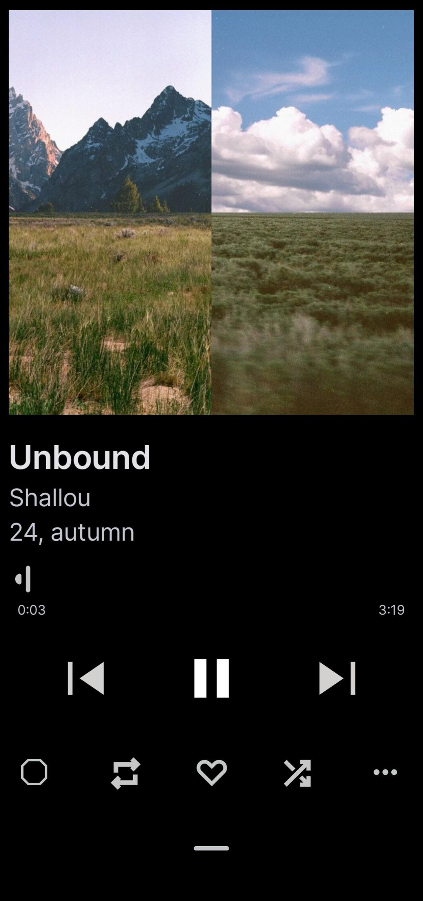
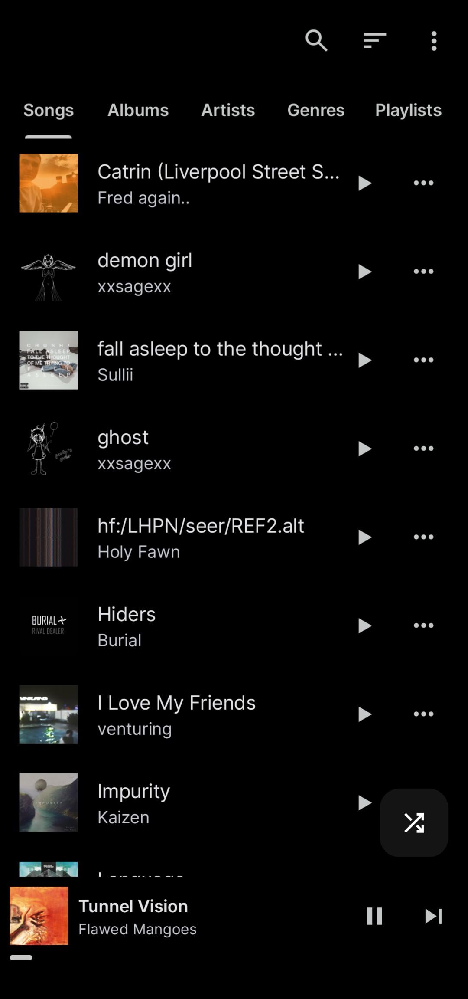
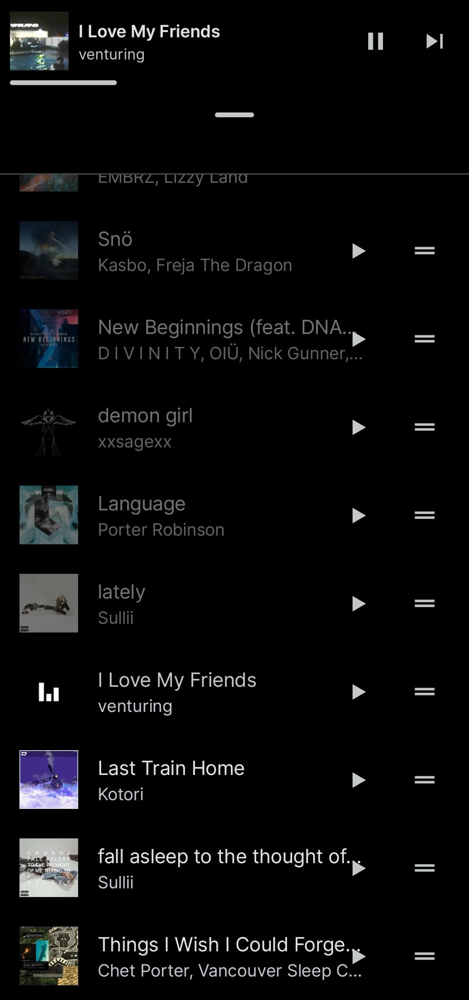
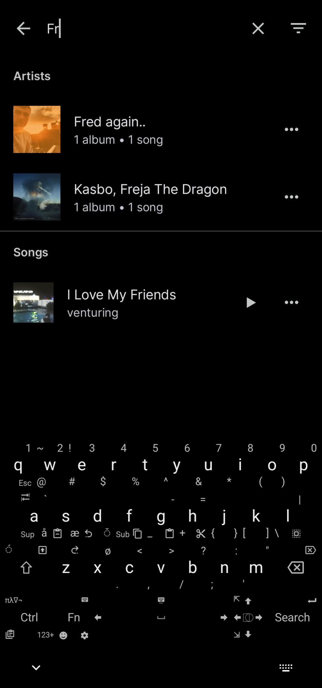
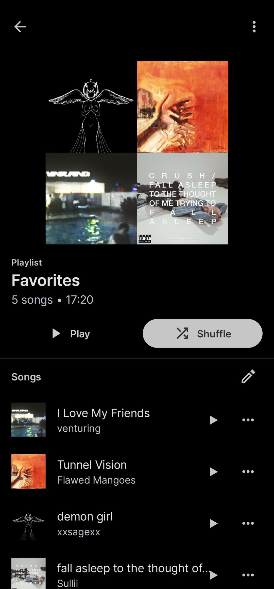
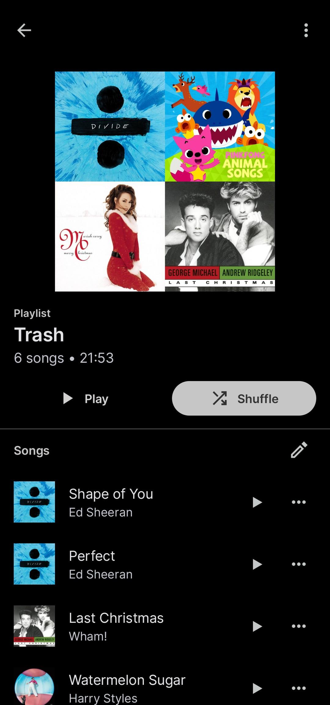

# Muxio 

This is a fork of [Auxio](https://github.com/OxygenCobalt/Auxio) by OxygenCobalt.

## Screenshots

    
    
    
    
    
    
    

## Key Changes from Auxio
- **Play Next by Default**: Tapping a song queues it next instead of playing immediately.
- **Quick Play Button**: Added a dedicated "Play" action button on song items.
- **UI Overhaul**:
    - Simplified and more ergonomic layout
    - Visual feedback on song press
- **Special Playlists**:
  - Favorites:
    - New button to instantly add songs to this playlist.
  - Trash:
    - New button to send unwanted songs here.
    - Auto-skip feature: Songs in Trash are ignored during playback (they remain in your library but won’t play)
- **Previous**:
    Pressing "previous" within 7.5 seconds of a track’s start skips to the previous song (up from 3 seconds).
    
## Recommended Setup
1. **Theme**: In settings, select *Black mode* with *Grey* accent.  
   *(Other themes may have untested visual issues.)*

## Notes
- **Equalizer**: Removed in favor of external EQ apps.
- **Maintenance**: This fork is primarily for personal use. Minor issues may exist. I won't spend much time maintenance.